# service-payment
<h2>Test PT Buana Varia Komputama</h2>

Fitur

<ul>
<li>Spring web</li>
<li>JPA (Java Persintance API)</li>
<li>Databases with Postgres or MYSQL</li>
<li>Password with regex and BCrypt</li>
<li>JWT (JSON Web Token)</li>
</ul>

Instruction

<ol>
    <li>Add User</li>
    <li>Add Kategori (Request Header)</li>
    <li>Add Product (Request Header)</li>
    <li>Add Transation (Request Header)</li>
</ol>

Password with regex and bcrypt 
This regex

.png)

add user
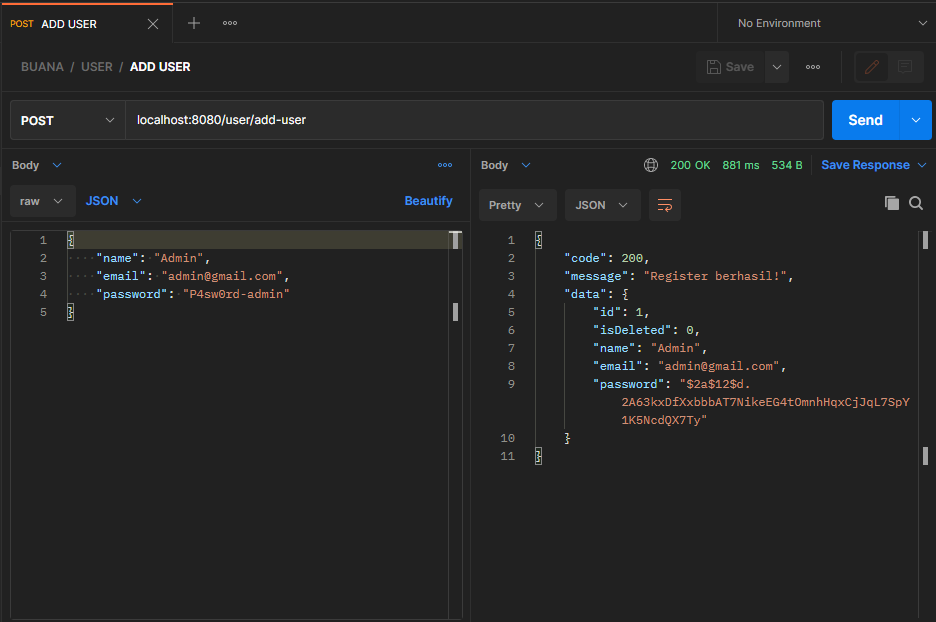

login gagal
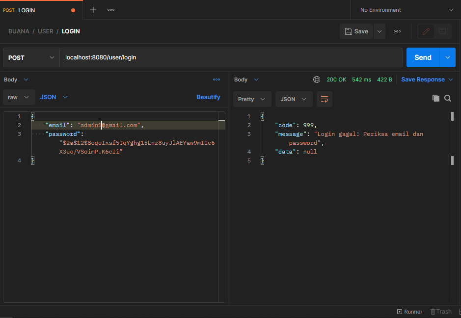

login success

add kategori
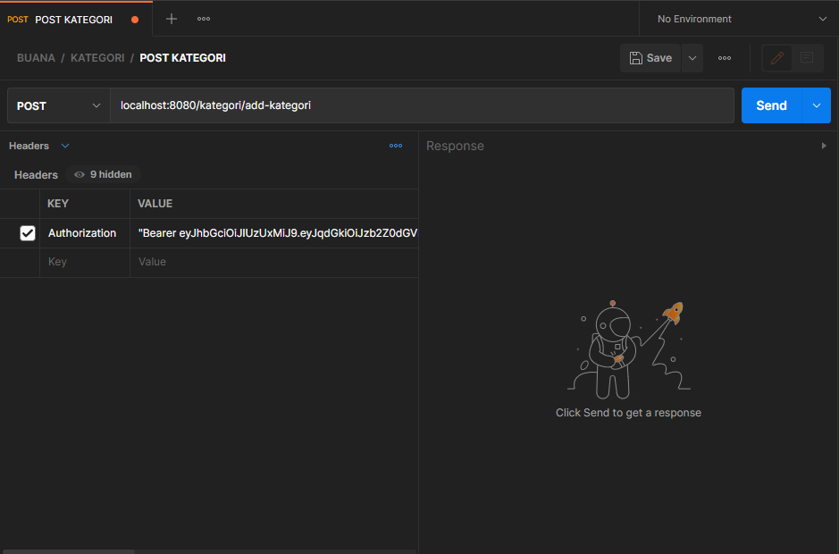

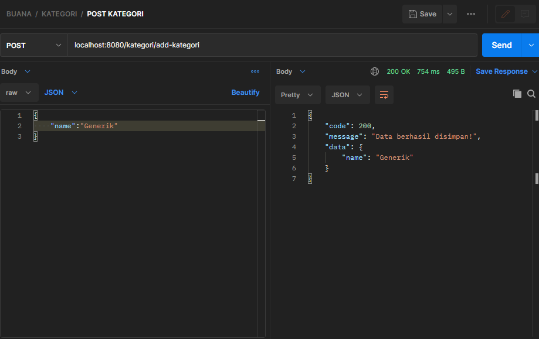

add product
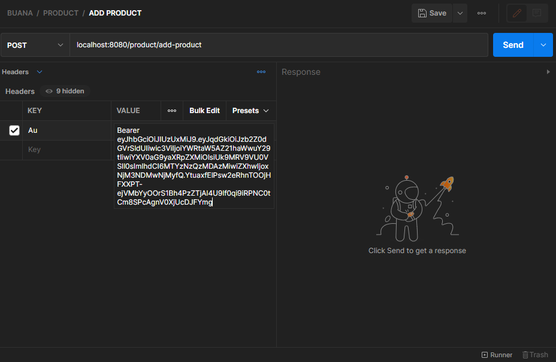

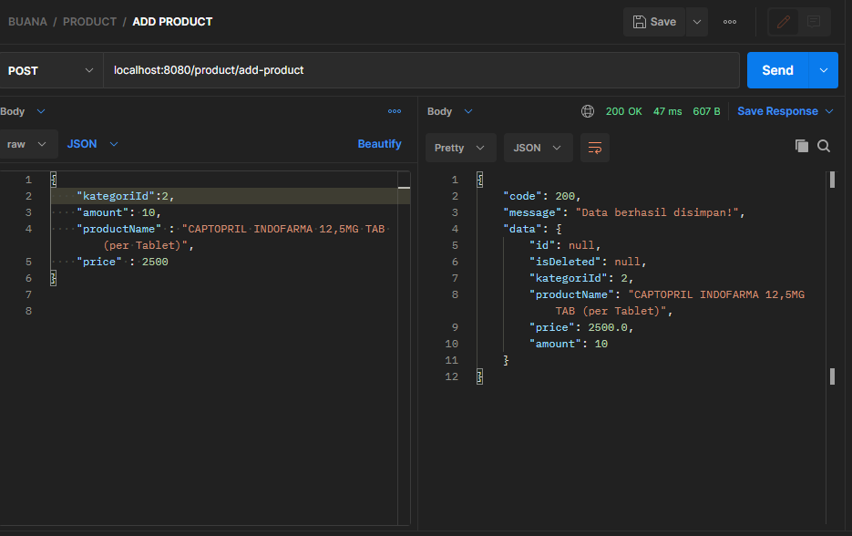

get product
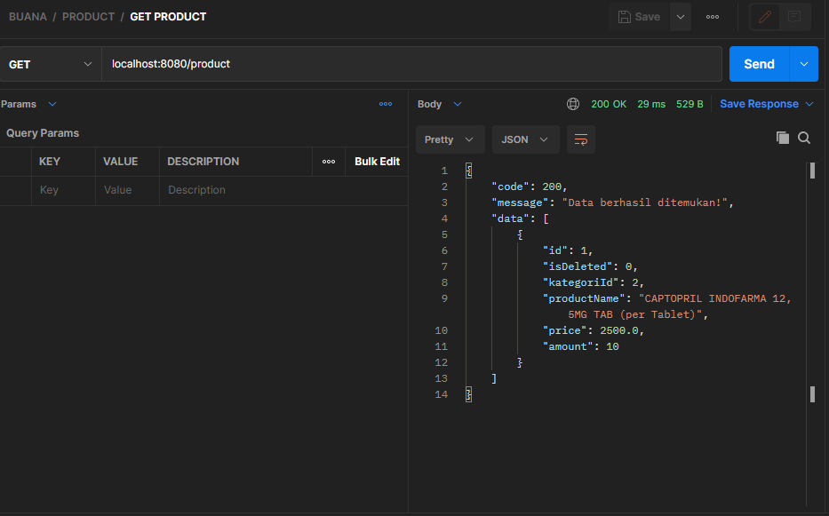

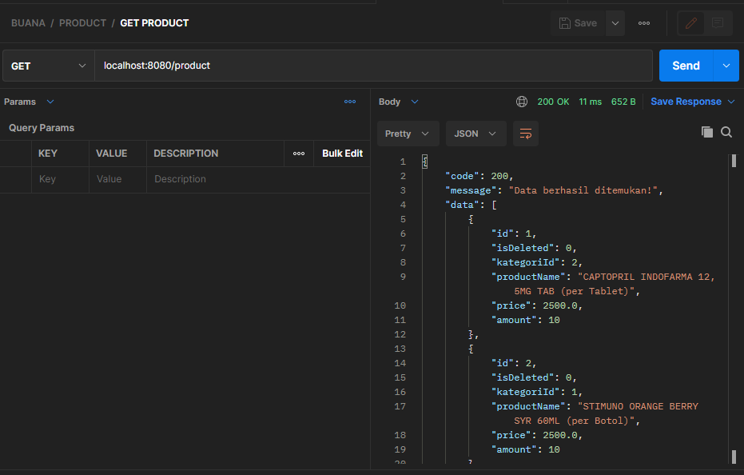

Add order
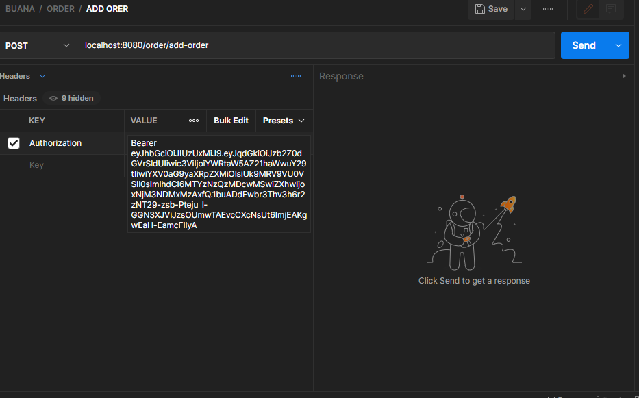

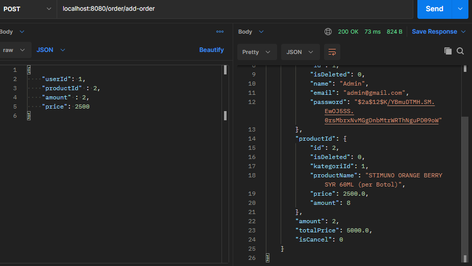

get order
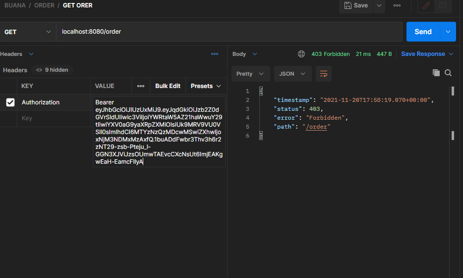
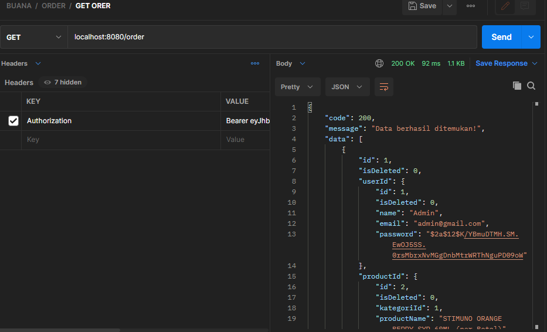
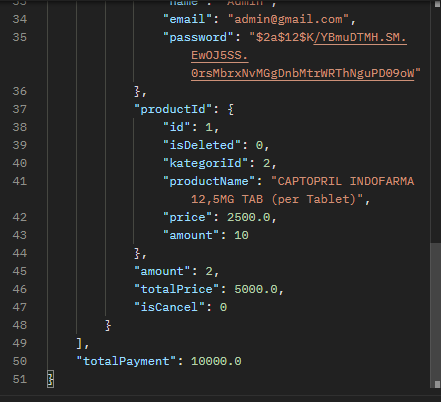

<h4>

by yantodev 
</h4>
